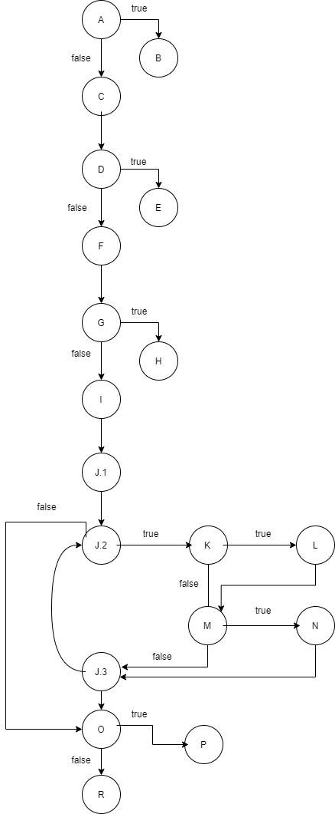

# Втора лабораториска вежба по Софтверско инженерство

## Дина Додевска, бр. на индекс 186015

### Група на код:

Ја добив групата на код 2

###  Control Flow Graph



### Цикломатска комплексност


### Тест случаи според критериумот Every statement

....

### Тест случаи според критериумот Multiple condtition
```    @Test(expected = RuntimeException.class)
       public void test3_1() {
           SILab2 object = new SILab2();
           object.function(null, null);
       }
   
       @Test(expected = RuntimeException.class)
       public void test3_2() {
           SILab2 object = new SILab2();
           User user = new User(null, null, null);
           object.function(user,null);
       }
   
       @Test(expected = RuntimeException.class)
       public void test3_3() {
           SILab2 object = new SILab2();
           User user = new User("dina", "dina", "dina@students.finki.ukim.mk");
           LinkedList<String> list = new LinkedList<>();
           list.add("dina");
           object.function(user,list);
       }
   
       @Test
       public void test3_4() {
           SILab2 object = new SILab2();
           User user = new User("dina","dina", null);
           assert(object.function(user, new LinkedList<String>()) == false);
       }
   
       @Test
       public void test3_5() {
           SILab2 object = new SILab2();
           User user1 = new User("dina","dina", "dinastudents.finki.ukim.mk");
           User user2 = new User("dina","dina", "dina@studentsfinkiukimmk");
           User user3 = new User("dina","dina", "dina@students.finki.ukim.mk");
           LinkedList<String> list = new LinkedList<String>();
   
   
           assert(object.function(user1, list) == false);
           assert(object.function(user2, list) == false);
           assert(object.function(user3, list) == true);
   
       }
```

### Објаснување на напишаните unit tests

...
...